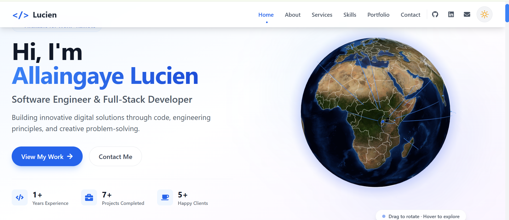
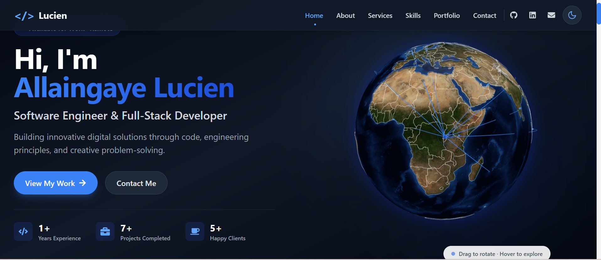
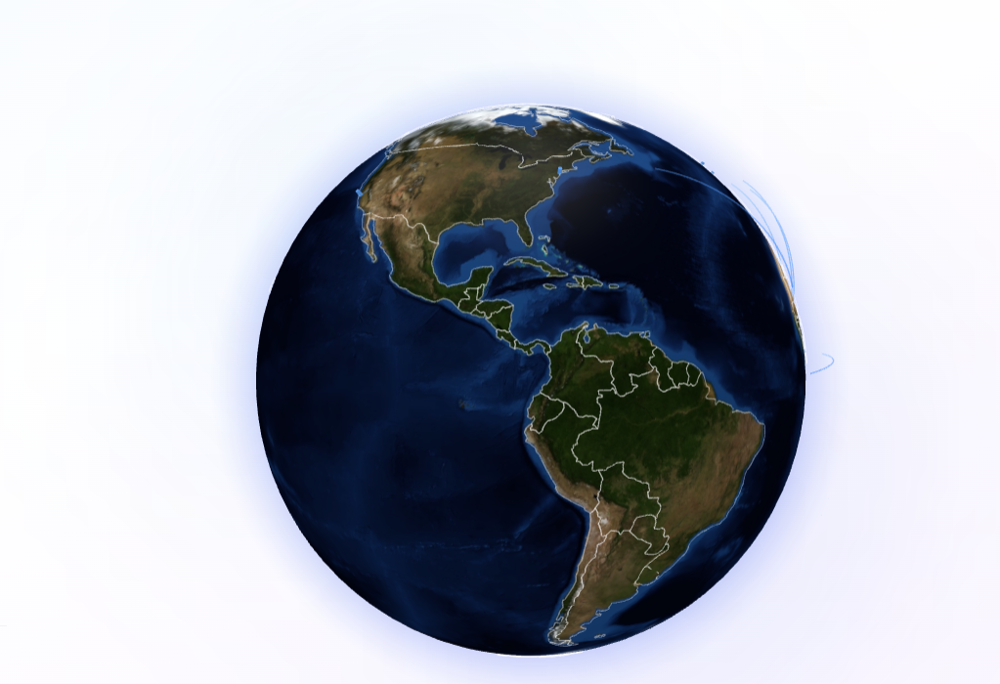
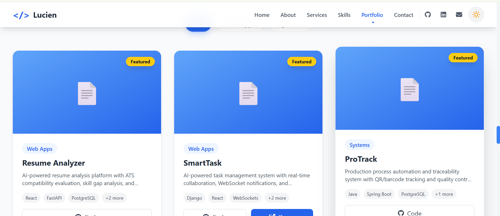

<div align="center">

# 🌐 Portfolio — Allingaye Lucien

### Software Engineer & Full-Stack Developer

**A modern, responsive portfolio showcasing my projects, skills, and experience.**

[](https://portfolio-dg3fqyw7h-allaingaye.vercel.app/)
[](https://github.com/allaingaye)
[](https://linkedin.com/in/allaingaye)
[](mailto:lucienallingaye@gmail.com)

</div>

---

## 🔗 Live Demo

👉 **[https://portfolio-dg3fqyw7h-allaingaye.vercel.app/](https://portfolio-dg3fqyw7h-allaingaye.vercel.app/)**

---

## ✨ Features

- 🎨 **Modern UI/UX** — Clean, professional design with smooth animations
- 🌓 **Dark & Light Mode** — Toggle between themes with localStorage persistence
- 🌍 **Interactive 3D Globe** — Showcases location (Rwanda) with global tech hub connections
- 📱 **Fully Responsive** — Works perfectly on mobile, tablet, and desktop
- ⚡ **Fast Performance** — Built with Vite for lightning-fast builds
- 🎬 **Smooth Animations** — Powered by Framer Motion
- 📧 **Working Contact Form** — EmailJS integration for real email delivery
- 📄 **Downloadable CV** — One-click download of my resume
- 🎯 **Portfolio Showcase** — Interactive filtering by project category
- 📊 **Skills Visualization** — Animated skill bars with proficiency levels

---

## 🛠️ Tech Stack

### Frontend


### Libraries & Tools


### Services


---

## 📂 Project Structure

```
portfolio/
├── public/
│   ├── profile.jpeg          # Profile photo
│   ├── cv.pdf                # Downloadable CV
│   └── favicon.ico
│
├── src/
│   ├── components/
│   │   ├── Navbar.jsx        # Navigation with theme toggle
│   │   ├── Hero.jsx          # Hero section with globe
│   │   ├── About.jsx         # About section
│   │   ├── Services.jsx      # Services offered
│   │   ├── Skills.jsx        # Skills with progress bars
│   │   ├── Portfolio.jsx     # Projects showcase
│   │   ├── Testimonials.jsx  # Client testimonials
│   │   ├── Contact.jsx       # Contact form (EmailJS)
│   │   ├── Footer.jsx        # Footer with social links
│   │   ├── ThemeToggle.jsx   # Dark/light mode toggle
│   │   └── WorldGlobe.jsx    # Interactive 3D globe
│   │
│   ├── contexts/
│   │   └── ThemeContext.jsx  # Theme state management
│   │
│   ├── data/
│   │   └── data.js           # Centralized portfolio data
│   │
│   ├── App.jsx
│   ├── main.jsx
│   └── index.css
│
├── package.json
├── tailwind.config.cjs
├── postcss.config.cjs
└── vite.config.js
```

---

## 🚀 Getting Started

### Prerequisites

- **Node.js** 18+ — [Download](https://nodejs.org/)
- **npm** or **yarn**
- **Git** — [Download](https://git-scm.com/)

### Installation

1. **Clone the repository:**

   ```bash
   git clone https://github.com/allaingaye/portfolio.git
   cd portfolio
   ```

2. **Install dependencies:**

   ```bash
   npm install
   ```

3. **Set up environment variables:**

   Create a `.env` file in the root directory:

   ```env
   VITE_EMAILJS_SERVICE_ID=your_service_id
   VITE_EMAILJS_TEMPLATE_ID=your_template_id
   VITE_EMAILJS_PUBLIC_KEY=your_public_key
   ```

4. **Start the development server:**

   ```bash
   npm run dev
   ```

5. **Open in your browser:**

   ```
   http://localhost:5173
   ```

---

## 🎨 Customization

### Update Your Information

Edit `src/data/data.js` to customize:

```javascript
export const personalInfo = {
  name: "Your Name",
  title: "Your Title",
  email: "your@email.com",
};
```

### Change Theme Colors

Edit `tailwind.config.cjs`:

```javascript
colors: {
  primary: {
    500: '#3b82f6',
    600: '#2563eb',
  }
}
```

### Update Projects

Add or edit projects in `src/data/data.js`:

```javascript
export const portfolioProjects = [
  {
    id: 1,
    title: "Project Name",
    category: "Web Apps",
    description: "...",
    technologies: ["React", "Node.js"],
    github: "https://github.com/...",
    liveDemo: "https://...",
    featured: true,
  },
];
```

---

## 🌐 Deployment

This portfolio is deployed on **Vercel** with automatic deployments.

### Deploy Your Own

1. Push to GitHub
2. Go to [vercel.com](https://vercel.com)
3. Import your repository
4. Add environment variables
5. Deploy!

Every push to `main` will trigger an automatic deployment.

---

## 📸 Screenshots

> 📸 Screenshots coming soon! Visit the [live demo](https://portfolio-dg3fqyw7h-allaingaye.vercel.app/) to see it in action.

<!-- 
When you have screenshots ready, uncomment and add them to /public:

### 🏠 Home Page (Light Mode)


### 🌙 Home Page (Dark Mode)


### 🌍 Interactive 3D Globe


### 💼 Portfolio Section

-->

---

## 🤝 Contributing

Contributions, issues, and feature requests are welcome!

1. Fork the project
2. Create your feature branch (`git checkout -b feature/AmazingFeature`)
3. Commit your changes (`git commit -m 'Add some AmazingFeature'`)
4. Push to the branch (`git push origin feature/AmazingFeature`)
5. Open a Pull Request

---

## 👨‍💻 Author

**Allingaye Lucien**

- 🌐 Portfolio: [portfolio-dg3fqyw7h-allaingaye.vercel.app](https://portfolio-dg3fqyw7h-allaingaye.vercel.app/)
- 💼 LinkedIn: [@lucien-allaingaye](https://linkedin.com/in/lucien-allaingaye)
- 🐙 GitHub: [@allaingaye](https://github.com/allaingaye)
- 📧 Email: [lucienallingaye@gmail.com](mailto:lucienallingaye@gmail.com)

---

## 🙏 Acknowledgments

- [React](https://react.dev/)
- [Vite](https://vitejs.dev/)
- [Tailwind CSS](https://tailwindcss.com/)
- [Framer Motion](https://www.framer.com/motion/)
- [React Globe](https://github.com/vasturiano/react-globe.gl)
- [EmailJS](https://www.emailjs.com/)
- [Vercel](https://vercel.com/)

---

## 📄 License

This project is **MIT Licensed** — see the [LICENSE](LICENSE) file for details.

```
MIT License

Copyright (c) 2025 Allingaye Lucien

Permission is hereby granted, free of charge, to any person obtaining a copy
of this software and associated documentation files (the "Software"), to deal
in the Software without restriction, including without limitation the rights
to use, copy, modify, merge, publish, distribute, sublicense, and/or sell
copies of the Software, and to permit persons to whom the Software is
furnished to do so, subject to the following conditions:

The above copyright notice and this permission notice shall be included in all
copies or substantial portions of the Software.

THE SOFTWARE IS PROVIDED "AS IS", WITHOUT WARRANTY OF ANY KIND, EXPRESS OR
IMPLIED, INCLUDING BUT NOT LIMITED TO THE WARRANTIES OF MERCHANTABILITY,
FITNESS FOR A PARTICULAR PURPOSE AND NONINFRINGEMENT. IN NO EVENT SHALL THE
AUTHORS OR COPYRIGHT HOLDERS BE LIABLE FOR ANY CLAIM, DAMAGES OR OTHER
LIABILITY, WHETHER IN AN ACTION OF CONTRACT, TORT OR OTHERWISE, ARISING FROM,
OUT OF OR IN CONNECTION WITH THE SOFTWARE OR THE USE OR OTHER DEALINGS IN THE
SOFTWARE.
```

---

<div align="center">

### ⭐ If you like this project, please give it a star!

**Built with ❤️ in Rwanda 🇷🇼**

</div>